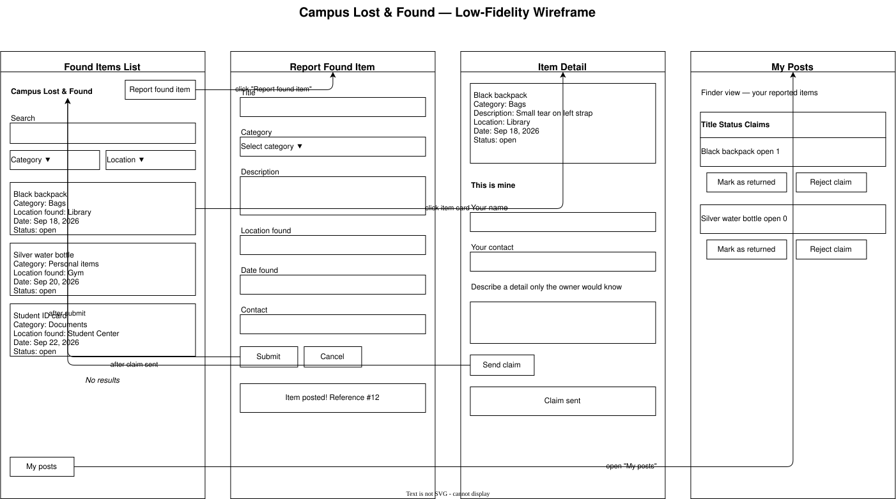

# Campus-Lost-Found-Hub---Project-

**Current stage:** Milestone 1 — design draft. This README is updated throughout the project; we do not start a separate document for each milestone.

This draft contains open questions and undecided points on purpose. There is no running backend, database or complete OpenAPI contract yet. Our idea is our own, but it borrows the workflow/sketch/sample-data approach from the class exercises (the bar ordering scenario); the adaptations are noted below.

## Project overview

Campus Lost & Found is a web application where students post items they have **found** on campus, and students who are **missing** something can browse and search those posts to find their belongings. Today, lost items end up in scattered places: group chats, notice boards, the reception desk. Owners do not know where to look, and finders do not know whom to give the item to. Our app provides one searchable place for all of it.

### Team and initial responsibilities

| Member | Initial responsibility | Next action |
|---|---|---|

| Fernando | Users and workflow | Describe needs and the steps of the "report found item → reclaim" workflow |
| Bernardo | Sketches and interaction | Sketch the screens and feedback for that workflow |
| Ilir     | Data and API exploration | Prepare sample JSON and clarify the proposed operations |
| Davide   | Coordination and README | Keep decisions, questions and the milestone commit together |

These are starting responsibilities, not permanent silos. We review each other's work and rotate roles as needed so that everyone understands the whole draft.

## 1. Analysis

### Scenario, users and goals

- **Situation or problem:** A student finds a water bottle, student card or jacket in a lecture hall and does not know what to do with it. Meanwhile, the owner is searching for it, and has no central place to check.
  
- **Intended users:**
  - *Finder* (student / Teacher): wants to report a found item quickly, hand it over with minimal effort and without becoming responsible for it long-term.
    Especially now that staff and students in Basel have upgraded to a much bigger campus as of late 2026, lost items are becoming more common. Current options: leaving        the item at a reception desk, posting in scattered group chats, or simply leaving it in place. None offer a reliable way for the owner to find it or for the finder to      know when it has been claimed.
    
    Needs:
      - A simple form that can be filled in under 1–2 minutes
      - Clear confirmation that the item has been posted (with a reference)
      - A straightforward way to review claims and mark the item as returned
      - Privacy: contact details and sensitive information should not be shown publicly
      - Confidence that only a plausible owner will receive the item
        
    Success: the item is claimed by the rightful owner, the finder can mark it as returned, and the process requires no further action.
     
  - *Seeker / owner* (student): wants to check whether their missing item has been found, ideally by searching by category, place or date.
    
    Needs:
    - Efficient search & filtering (keyword, category, location, date)
    - Clear, trustworthy item details without exposing private contact info
    - A simple, secure way to prove ownership (the “hidden detail” claim)
    - Immediate feedback on the status of their claim
      
    Success: the seeker should be able to go from “I lost my bottle” to “claim submitted” in under a minute, and feel confident that only the real owner can successfully       claim the item.

  - *(Possible later role)* Campus staff / moderator: handles items left at a reception desk and removes inappropriate posts.
- **Proposed benefit:** Items are returned faster, finders have a clear process, and owners have one place to look.
- **Initial scope:** We explore **one workflow first**: a finder posts a found item, a seeker finds it and claims it, and the finder marks it as returned.
  - *Can wait:* "I lost something" posts by seekers, automatic matching/notifications, user accounts with campus login, photo upload, moderator tools.

### User stories and first workflow

- As a **finder**, I want to post a found item with a short description and where I found it, so that its owner can recognise it.
- As a **seeker**, I want to search and filter found items by keyword, category and place, so that I can quickly check whether mine is there.
- As a **seeker**, I want to claim an item and describe a detail only the owner would know, so that the finder can be sure to hand it to the right person.
- As a **finder**, I want to mark an item as returned, so that it disappears from the list of open items.

**Out of initial scope:** payments, rewards, chat inside the app, items found off campus.

| Step | User / role | Action | Information needed | Expected result or feedback |
|---|---|---|---|---|
| 1 | Finder | Opens "Report found item" and fills in the form | Title, category, description, place found, date found, contact/handover info | Confirmation "Item posted" with a reference number; item appears in the list |
| 2 | Seeker | Browses or searches the list of found items | Keyword, category, place (optional filters) | List of matching open items (or "no results" message) |
| 3 | Seeker | Opens an item and submits a claim | Name, contact, a description of a detail not shown publicly | Confirmation "Claim sent"; item status changes to *claimed* |
| 4 | Finder | Reviews the claim and arranges handover | Claim details | Finder decides whether the claim is plausible |
| 5 | Finder | Marks item as returned | Item reference | Status changes to *returned*; item is hidden from the default list |

**Questions and exceptions worth discussing**
- Two people claim the same item. Who gets it, and what does the second claimant see?
- The finder never reacts to claims. Should items expire after some time (e.g. 30 days)?
- A post includes a sensitive item (student card, ID). How much information is visible publicly?
- A claim is false. How does the finder reject it without breaking the item's status?

## 2. Design

### Screens and navigation



**Main inputs, actions and feedback**

| Screen | Main inputs | Main actions | Feedback |
|---|---|---|---|
| Found items list | Search text, category, location | Search, filter, open item | Result count, "no results" hint |
| Report found item | Title, category, description, location, date, contact | Submit | Success message with reference, validation errors under fields |
| Item detail | Claim description, claimant contact | Claim item | "Claim sent", or notice that the item is already claimed/returned |
| My posts | – | Mark as returned, reject claim | Updated status |

A polished or clickable prototype is not required for this milestone.

### Domain concepts and example data

Sample JSON files (fictional data) are kept in `docs/examples/`:

- `docs/examples/found_item.json`
- `docs/examples/claim.json`
- `docs/examples/categories.json`

**Found item**
```json
{
  "id": 12,
  "title": "Blue water bottle",
  "category": "bottle",
  "description": "Metal bottle with a sticker on the side.",
  "location_found": "Building A, lecture hall 2",
  "date_found": "2026-10-01",
  "status": "open",
  "finder_contact": "finder@example.com"
}
```

**Claim**
```json
{
  "id": 5,
  "item_id": 12,
  "claimant_name": "Alex Example",
  "claimant_contact": "alex@example.com",
  "proof_description": "The sticker shows a mountain and there is a dent near the lid."
}
```

**Field notes**
- `category`: one of a fixed list (e.g. `bottle`, `keys`, `clothing`, `electronics`, `id_card`, `bag`, `other`). *Uncertain: fixed list or free text?*
- `status`: `open` → `claimed` → `returned` (possibly also `expired`). *Uncertain: do we need a separate `rejected` state for claims?*
- `item_id` in a claim refers to a found item (one item can have many claims).
- `proof_description` is visible only to the finder, never publicly.
- `finder_contact` should not be shown to everyone (see open questions on privacy).

### Business rules and possible operations

**Rules in plain language**
- A found item needs at least a title, a category, a place and a date; the date must not be in the future.
- An item can only be claimed while its status is `open`.
- A claim must include a proof description, so that owners describe something not visible in the post.
- Returned items are not shown in the default search results.
- *Exception:* if an item is already `claimed`, further claims are either rejected or put in a queue. *(Undecided.)*

Later, we will explain where the implementation enforces each rule.

| User goal | Proposed action | Example input | Expected output | Open question |
|---|---|---|---|---|
| Report a found item | Create | Title, category, description, place, date, contact | New item with identifier and status `open` | Do we require login to post? |
| Browse/search found items | Read (list, filter) | `?q=bottle&category=bottle&status=open` | List of matching items | Pagination needed? |
| View one item | Read (single) | Item id | Item details without private data | Which fields are public? |
| Claim an item | Create (claim) | Item id, name, contact, proof | Claim with identifier; item status `claimed` | What if two people claim at once? |
| Mark item as returned | Change | Item id | Status `returned` | Who is allowed to do this? |
| Remove a wrong or inappropriate post | Remove | Item id | Item no longer listed | Delete or just hide? |

These are draft ideas in plain language, not a complete CRUD implementation. Final endpoints follow after coaching.

### Inspiration from existing apps or APIs — optional

- *[Link to an existing lost-and-found site or app, e.g. a university or transport-company portal.]* We would adopt the simple category and location filters and improve privacy by never showing contact details publicly.

No external API integration is planned for this milestone.

## 3. Project management

### Decisions, open questions and next steps

| Question / decision | Current position | Next step / person |
|---|---|---|
| Do users need an account? | Undecided; likely a simple contact field first, login later | Discuss in team, Ilir |
| How do we verify ownership? | Claim with hidden detail, finder decides | Refine claim form, Fernando |
| How much is public? | Hide contact info and the "proof" text | Decide on fields for item detail, Davide |
| Do items expire? | Probably after 30–60 days | Check what is realistic to implement, Davide |
| Should seekers also be able to post "lost" items? | Out of scope for now | Revisit after Milestone 2 |
| Photos for items? | Nice to have, later | Decide after the first workflow works |

### Milestone progress

| Milestone | Available evidence | Status / next step |
|---|---|---|
| 1 — Design draft | Analysis, workflow, sketches, example JSON and proposed operations | [Links and open questions] |
| 2 — Contract and available implementation | OpenAPI contract and implemented/tested progress | [Update later] |
| Integration — later | Revised feature scope, frontend decision, architecture and a connected workflow | [Update after classroom examples; details in Moodle] |

The complete milestones, dates and assessment criteria are in the Moodle assignment. We describe contributions and decisions here; commit counts do not measure individual effort.

## 4. References and acknowledgements

- Class exercises and the bar ordering scenario (workflow, sketch and sample-data approach), adapted here to a lost-and-found context.
- *[Add documentation, reused assets, libraries and any other assistance (including AI tools) here, with a note on how we adapted them.]*
